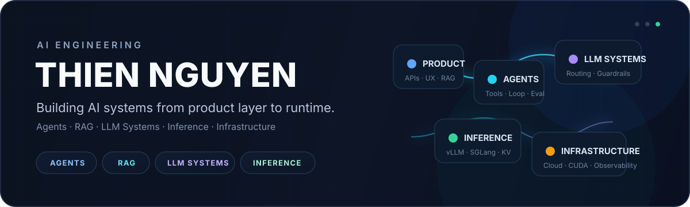

  

  
  

  <b>AI Engineer</b> building systems across <b>applications, agents, LLMs, and infrastructure</b>.

 

AI Engineering

  
    
  <code>RAG</code> · <code>GraphRAG</code> · <code>Knowledge Systems</code> · <code>Multimodal</code> · <code>AI APIs</code>

  
    
  <code>Harnesses</code> · <code>Tool Use</code> · <code>Context Engineering</code> · <code>Memory</code> · <code>Agent Loops</code> · <code>Evals</code>

  
    
  <code>Retrieval</code> · <code>Reranking</code> · <code>Structured Generation</code> · <code>Routing</code> · <code>Guardrails</code>

  
    
  <code>Inference</code> · <code>vLLM</code> · <code>SGLang</code> · <code>CUDA</code> · <code>Observability</code> · <code>Distributed Systems</code>

 

Selected Work

infercap

LLM inference engineering toolkit — preflight, serving configuration, verification, benchmarking, telemetry, and capacity analysis.

  
  
  
  
  

 

Toolbox

  
  
  
  
  
  
  
  
  
  
  
  

  
  
  
  
  
  
  

 

  Applications → Agents → LLMs → Systems

